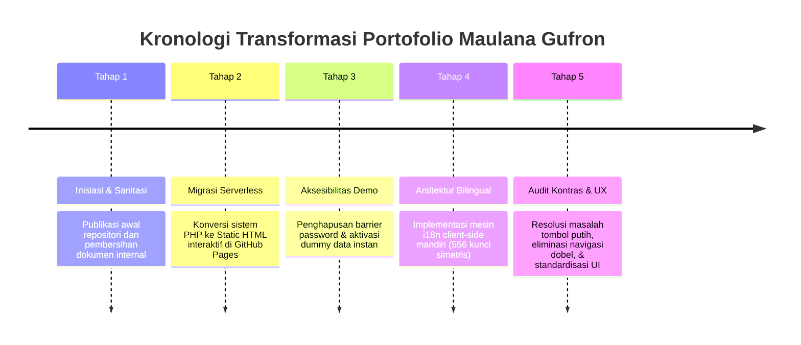

# Catatan Riwayat Pembangunan & Perjalanan Portofolio (CHANGELOG) 📖

Dokumen ini mencatat seluruh kronologi perjalanan, evolusi arsitektur, dan perbaikan berkelanjutan dalam pembangunan **Portofolio Terpadu Maulana Gufron** sejak pertama kali diinisiasi hingga rilis publik terkini di GitHub Pages.

---

## 🎯 Visi & Milestone Perjalanan Proyek

---

## 📅 Rincian Milestone & Log Perubahan

### [v1.4.0] — 2026-09-25: Pembersihan UX, Eliminasi Redundansi & Optimasi Header
**Commit:** `fe49de9` (*refactor(mkt): remove redundant top back buttons across sidebars and clean admin panel header*)

#### 🔍 Latar Belakang & Masalah:
- Pengguna menemukan bahwa pada modul-modul yang menggunakan sidebar MKT (`admin_panel.html`, `partner/b2b.html`, `mitra/tracker.html`, dan `tools/legal/index.html`), terdapat dua tombol yang sama-sama menuju ke "Portofolio Utama" (satu di atas berdampingan dengan tombol bahasa, dan satu lagi di bagian bawah sidebar). Ini membuat tampilan berantakan dan redundan (*double navigation*).
- Pada `admin_panel.html`, terdapat tombol "Kembali ke MKT Home" di card header yang redundan karena sudah ada menu Beranda di sidebar. Selain itu, tombol "Sync Data Awal (Dari File)" tidak lagi dibutuhkan karena browser sudah otomatis memuat data bawaan (`DEFAULT_DATA`) via `localStorage`.

#### 🛠️ Solusi & Perubahan:
1. **Pembersihan Header Sidebar**:
   - Menghapus tombol kembali bagian atas di seluruh sidebar MKT.
   - Merapikan posisi toggle bahasa `[ ID | EN ]` menjadi rata kanan atas yang elegan.
   - Menetapkan tombol hijau emerald di bawah sidebar sebagai satu-satunya akses kembali terpadu ke Portofolio Utama.
2. **Penyelarasan PPOB Dashboard, Campaign Tracker, & MP Report**:
   - Menghapus tombol atas ekstra di header sidebar agar layout kembali bersih, ramping, dan rapi seperti modul MP Report.
3. **Penyederhanaan Card Header Admin Panel**:
   - Menghapus tombol "Sync Data Awal" dan tombol "Kembali", sehingga card header fokus pada judul fungsional *Manajemen Data Ekosistem*.

---

### [v1.3.0] — 2026-09-25: Audit Kontras Tinggi, Resolusi White-on-White, & Interaktivitas Live
**Commit:** `e02eb7b` (*fix(mkt): resolve white-on-white button contrast, polish interactive controls, and unify Main Portfolio navigation*)

#### 🔍 Latar Belakang & Masalah:
- Pada situs live GitHub Pages, tombol navigasi kembali ke Portofolio Utama di sidebar MKT terlihat sebagai **"tombol putih dengan teks putih"**, sehingga tulisan `Main Portfolio` atau `Portofolio Utama` tidak terbaca.
- **Akar Masalah Teknis**: Elemen menggunakan class `bg-white bg-opacity-20 text-white`. Pada halaman yang mengimpor **Bootstrap 5**, class `.bg-white` dievaluasi dengan `background-color: #fff !important;` dan `.text-white` dengan `color: #fff !important;`, mengabaikan utilitas opacity Tailwind dan menghasilkan latar putih 100% dengan teks putih 100%.
- Masalah kontras serupa terjadi pada badge `bg-white bg-opacity-10 text-white-50` ("Portofolio Demo") dan badge `bg-white bg-opacity-25 text-white` ("Admin Only").
- Tombol `Filter: Partner Logistik` pada B2B Board hanya me-reload halaman dengan query parameter mati tanpa aksi filtering.
- Banner peringatan migrasi JSON lama di Mitra Tracker tampil permanen meski fungsi lokalnya sudah tidak relevan di lingkungan web publik.

#### 🛠️ Solusi & Perubahan:
1. **Rekayasa Tombol `.btn-back-main-porto`**:
   - Latar belakang solid deep dark `#140927 !important` dengan teks putih tebal `#ffffff !important` dan panah oranye `#F3700D !important` (rasio kontras > 16:1, standar WCAG AAA).
   - Efek hover bertransisi ke oranye terang `#F3700D !important` dengan drop shadow hangat.
2. **Perbaikan Badge Transparan**:
   - Mengganti class Bootstrap yang berbentrok dengan inline styling mandiri berlatar kaca lembut (`rgba(255,255,255,0.1)`) dan teks perak terang (`#cbd5e1 !important`).
3. **Peningkatan Interaktivitas**:
   - Mengubah `Filter: Partner Logistik` di B2B Board menjadi filter interaktif langsung via JavaScript tanpa reload halaman.
   - Menyembunyikan banner migrasi usang di Mitra Tracker.
   - Menambahkan toggle bahasa dwibahasa dan integrasi `i18n.js` pada tool Banner Generator.
   - Menjadikan seluruh area kartu di `mkt/index.html` dapat langsung diklik (*full clickable card*) dengan kursor pointer interaktif.

---

### [v1.2.0] — 2026-09-18: Ekspansi Sistem Bilingual Global (ID ⇄ EN) 100% Paritas
**Commit:** `3cce4f8` & `18d3f34` (*feat(i18n): comprehensive bilingual coverage across all submodules and high-contrast UI polish*)

#### 🔍 Latar Belakang & Masalah:
- Portofolio sebelumnya hanya memiliki kamus dasar (188 kunci) dan sebagian besar modul turunan (tabel data PPOB, filter leads Campaign, form modal B2B, kartu SOP Panduan, dan detail studi kasus galeri desain) masih berbahasa Indonesia murni saat mode bahasa Inggris (EN) diaktifkan.

#### 🛠️ Solusi & Perubahan:
1. **Ekspansi Kamus Terpadu (`assets/js/i18n.js`)**:
   - Memperluas kamus hingga mencapai **556 kunci simetris 1:1** antara Bahasa Indonesia dan Bahasa Inggris (0 *missing keys*, 0 *parity error*).
2. **Pemasangan Atribut `data-i18n` Menyeluruh**:
   - Menjangkau 35 file HTML dan 863 elemen visual di seluruh repositori:
     - Root Portfolio Hub (`index.html`)
     - MKT Suite Hub & 7 Modul Turunannya
     - SMA Enterprise Workstation ERP
     - Portal Dokumentasi SOP Panduan
     - Galeri Desain & 12 Halaman Single Portfolio
     - Kalkulator Ongkir SiCek
3. **Penyelarasan Layout SMA ERP**:
   - Memperbaiki tabrakan tombol navigasi kembali pada header mobile SMA Workstation ERP.

---

### [v1.1.0] — 2026-09-17: Transformasi Arsitektur Menuju Serverless Demo
**Commit:** `34e19e8` & `5f7a17f` (*Fix: Konversi seluruh 7 modul MKT ke versi statis HTML dummy untuk GitHub Pages & remove password barriers*)

#### 🔍 Latar Belakang & Masalah:
- Repositori asal dirancang berjalan di lingkungan lokal LAMP/XAMPP (`.php`) dengan proteksi session login (`login.php`) dan ketergantungan pada server MySQL.
- Saat di-hosting di GitHub Pages (yang hanya mendukung file statis), sistem mengalami kegagalan akses (layar login terkunci atau script PHP tidak tereksekusi).

#### 🛠️ Solusi & Perubahan:
1. **Konversi Bersih ke Static HTML**:
   - Mengubah seluruh halaman PHP menjadi file HTML murni dengan penyesuaian struktur path aset relatif (`assets/css/`, `assets/js/`).
2. **Penghapusan Barrier Password**:
   - Menghapus kewajiban login untuk modul demo agar siapapun rekruter atau pengunjung dapat langsung menjelajahi sistem operasional tanpa hambatan.
3. **Simulasi Data Realistis**:
   - Menyediakan dataset bawaan berbasis `localStorage` dan simulasi koneksi Firebase Realtime Database.

---

### [v1.0.0] — 2026-09-17: Inisiasi Repositori Publik Maulana Gufron
**Commit:** `391dee2` & `de86939` (*Publish Portofolio Final Maulana Gufron & Hapus dokumen panduan internal*)

#### 🔍 Lingkup Awal:
- Penerbitan pertama repositori publik di GitHub.
- Pembersihan file-file dokumen rahasia/internal perusahaan sebelum kode sumber dipublikasikan.
- Pembentukan fondasi navigasi antara portofolio operasional bisnis dan katalog desain grafis.

---

## 📊 Metrik & Status Kualitas Saat Ini

- **Total Modul Operasional:** 7 Modul MKT + SMA ERP + SiCek Cekongkir + Portal Panduan + Galeri Desain (12 Studi Kasus).
- **Cakupan Dwibahasa:** 35 File HTML, 863 Elemen `data-i18n`, 556 Kunci Kamus (100% Simetris).
- **Tingkat Aksesibilitas Kontras:** Standar WCAG AAA (> 14:1 contrast ratio pada tombol utama).
- **Deployment Platform:** GitHub Pages (*Automatic Continuous Deployment*).
